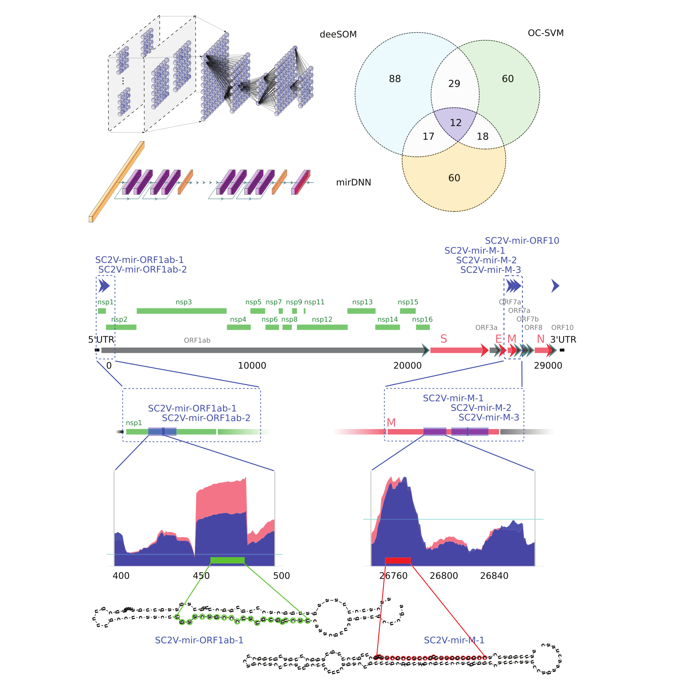
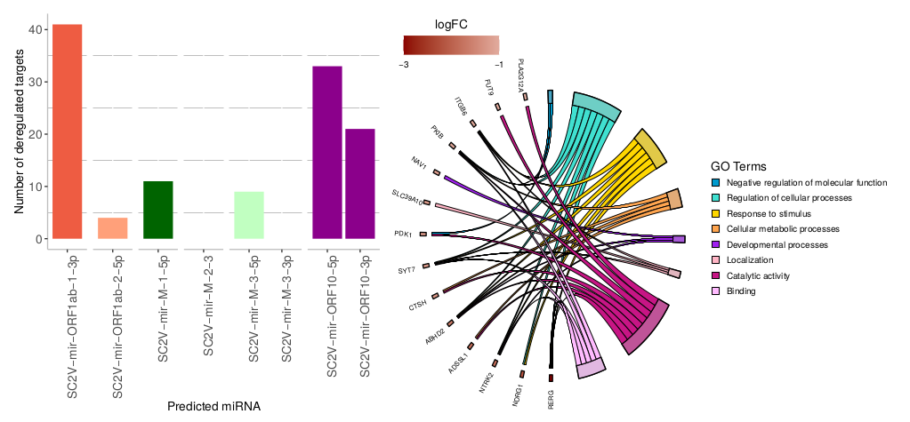

# Pipeline for  pre-miRNAs discovery in the SARS-CoV-2 virus

This readme contains a description of the steps to obtain the main results of:

G.A. Merino, J. Raad, L.A. Bugnon, C. Yones, L. Kamenetzky, J. Claus, F. Ariel, D.H. Milone, G. Stegmayer, “**Novel SARS-CoV-2 encoded small RNAs in the passage to humans**,” *Bioinformatics*, 2020, [DOI](https://doi.org/10.1093/bioinformatics/btaa1002).

The following sections contain the steps and the libraries used in each of them. All datasets and libraries are open sourced and free to use. If you use any of the following in your pipelines, please cite them properly.



## 1. Layout

Several intermediate results are provided in this repository, thus you don’t need to run the whole pipeline. 

```
sarscov2-mirna-discovery
│
├── genomes
│   └── NC_045512.2_Wuhan-Hu-1.fasta  -> The complete SARS-CoV2 isolate Wuhan-Hu-1 genome. 
│
├── sequences
│   ├── sars-cov2_hairpins.fasta      -> Hairpin sequences extracted from NC_045512.2_Wuhan-Hu-1.
│   ├── sars-cov2_hairpins.fold       -> sars-cov2_hairpins.fasta and its folding structure.
│   ├── pre-miRNAs_virus.fasta        -> Hairpin sequences extracted from known virus pre-miRNAs.
│   ├── pre-miRNAs_virus.fold         -> pre-miRNAs_virus.fasta and its folding structure. 
│   └── unlabeled_hairpins.fold       -> Hairpin sequences and its folding structure extracted from 
|                                           the human genome, sampled from sequences that do not code 
|   					    pre-miRNAs. Provided by external storage.
│
├── features
│   ├── sars-cov2_hairpins.csv        -> Features extracted from sars-cov2_hairpins.fasta.
│   ├── pre-miRNAs_virus.csv          -> Features extracted from pre-miRNAs_virus.fasta.
│   └── unlabeled_hairpins.csv        -> Features extracted from unlabeled_hairpins.fasta. 
|					     Provided by external storage.
│
├── models                            -> Trained models.
│
├── predictions                       -> Predictions on SARS-CoV2 hairpin sequences by each model.
│
├── src
|   ├── train_pre-miRNA_models.ipynb  -> Source code to train the models.
|   ├── predict_pre-miRNAs.ipynb      -> Source code to predict on SARS-CoV2 sequences.
|   ├── link_DE.R                     -> Script for differential expression analysis.
|   └── link_Figs.R                   -> Notebook to generate manuscript figures
|
├── matures                           
|   └── miRNAs.csv                    -> Mature miRNAs sequences found. 
|
└── targets                           -> Target prediction files
    ├── miRDB
    ├── Diana
    ├── TargetsDE
    └── overlap_<mirna>.tab            -> Target overlap for each miRNA 

```

##  2. Data preparation

Note that all the results generated in this section are provided in  [`sequences/`](sequences)  and  [`features/`](features) directories.

### 2.1. Download complete genomes

SARS-CoV-2 genome was obtained from the [NCBI GenBank](https://www.ncbi.nlm.nih.gov/nuccore/1798174254) on March 2020.

These ".fasta" files can be also found in this repository, in the [`genomes/`](genomes) directory.

### 2.2. Extract hairpin-like sequences

The SARS-CoV-2 genome fasta file is cut in overlapping windows using the [Hextractor R package](https://cran.r-project.org/web/packages/HextractoR/index.html) [[2]](#ref2).

You need to have the following software installed in your system:
- [R](https://www.r-project.org/) 
- [RNAfold](https://www.tbi.univie.ac.at/RNA/)
- [BLAST](https://ftp.ncbi.nlm.nih.gov/blast/executables/blast+/LATEST/)

In a R console, install and load the package with:
```R
> install.packages("snow")
> install.packages("HextractoR")
> library(HextractoR)
```

Then, run the main script with the following parameters:    

```R
> HextractoR("genomes/NC_045512.2_Wuhan-Hu-1.fasta", min_valid_nucleotides = 500, window_size = 600, window_step = 100, only_sloop = T, min_length = 60, min_bp = 16, margin_bp = 6, blast_evalue = 0.005, identity_threshold = 90, nthreads = 4, nworks = 4, filter_files = { })
```

This script generates a file with several hairpin-like sequences and its corresponding folding structure prediction. 

To model the positive class, well known pre-miRNAs from viruses hairpins were extracted from [mirbase](http://www.mirbase.org/). These sequences were 	folded with RNAfold using the following command:

```bash
RNAfold --noPS --infile=sequences/pre-miRNAs_virus.fasta --outfile=sequences/pre-miRNAs_virus.fold
```

Additional sequences were used to train the mirDNN. A set of 1M hairpin-like sequences from the human genome, which are not pre-miRNAs, were used to model the negative set. The folding structure (unlabeled_hairpins.fold) and features (unlabeled_hairpins.csv) for these sequences can be downloaded from [this external repository](https://sourceforge.net/projects/sourcesinc/files/mirdata/sequences/unlabeled.tar.gz). You will only need to download the unlabeled_hairpins.fold if you want to train the mirDNN. This data and further details are available in [[3]](#ref3).

At this point, the sequence and folding prediction for each hairpin-like sequence in SARS-CoV-2, the known virus pre-miRNAs and some human non-pre-miRNA sequences are ready.

### 2.3. Hairpin features extraction

In order to extract meaningful features from the sequences, the [miRNAfe package](http://sourceforge.net/projects/sourcesinc/files/mirnafe/0.90/) was used [[4]](#ref4). Once installed, you can run the feature extraction with:

```matlab
miRNAfe('sars-cov2_hairpins.fasta', 'config/Example_prediction.yaml');
miRNAfe('pre-miRNAs_virus.fasta', 'config/Example_prediction.yaml');
```
The ".yaml" file is provided with the package.  

## 3. Training pre-miRNAs prediction models

The [training notebook](src/train_pre-miRNA_models.ipynb) is provided with instructions to train the OC-SVM [[5]](#ref5), deeSOM [[6]](#ref6) and mirDNN [[7]](#ref7) classifiers. Doing so may take several hours. 

If you want to directly predict the sequences, you can use the trained models that are provided in [`models/`](models) as explained in the following section.

## 4. Finding pre-miRNAs candidates in SARS-CoV-2

The [prediction notebook](src/predict_pre-miRNAs.ipynb) is provided with instructions to use the trained models to rank the SARS-CoV-2 sequences (a high rank means a higher chance of being a pre-miRNA). 

## 5. Predicting miRNAs targets

Once mature miRNAs were identified by combining MatureBayes predictions and the small RNA-seq reads profiles, their sequences (provided in  [`matures/miRNAs.csv`](matures/miRNAs.csv)) must be  submitted to [Diana MR MicroT](http://diana.imis.athena-innovation.gr/DianaTools/index.php?r=mrmicrot/index) and [miRDB (Custom prediction)](http://www.mirdb.org/custom.html) for predicting human gene targets. 

The prediction files from miRDB and Diana MR Micro T, one per SARS-CoV-2 miRNA, are provided in the `[targets/miRDB/`](targets/miRDB/) and [`targets/Diana/`](targets/Diana) directories, respectively. Once you have downloaded them, you can run the following bash scripts for extracting the Ensembl identifiers (ID) and the score for each transcript predicted by Diana as being targeted for the viral miRNAs, with a prediction score of 70 or higher. 

```bash
sh ../src/extractIDs
```

After running this script, a new directory [`targets/Diana/70`](targets/Diana/70/) will be generated. Inside it, you should obtain the same files that are provided in this repository. Since Diana predicts transcripts and miRDB genes, Ensembl transcripts IDs were mapped to Gene names using the [mapping IDs](src/mappingIDs.Rmd) R notebook.

Once you have the Diana files ready (provided here in the [`targets/Diana/70/`](targets/Diana/70) folder, with the suffix `gene`), the following bash script will help you to combine them with miRDB predictions in order to obtain the set of targets that were predicted by both tools with scores predictions of 70 or higher.

```bash
sh ../src/jointargets.sh
```

After executing the code above, you will obtain eight files called `overlap_<mirna>.tab` with the set of human gene targets predicted for each  `mirna`  of the SARS-CoV-2 miRNA (provided here in the [`targets/`](targers) folder). You can explore the number of targets obtained for each miRNA and generate the Fig2**A** of [[1]](#ref1) by using the [targets exploration notebook](src/targetsExploration.Rmd).


## 6. Analyzing the down-regulation of the predicted targets

Expression data from RNA-seq experiments involving Calu3 cell-cultures infected with SARS-CoV-2 was downloaded from GEO-NCBI [GSE148729](ftp://ftp.ncbi.nlm.nih.gov/geo/series/GSE148nnn/GSE148729/suppl/GSE148729_Calu3_polyA_series1_readcounts.tsv.gz). The [differential expression notebook](src/link_DE.R) is provided with all the instructions to identify the set of differentially expressed genes. It can be used with: 

```R
link_DR()
```

Following these instructions, the list of deregulated targets and the set of those potentially being silenced by the predicted viral miRNAs can be obtained. 

## 7. Multiple sequence alignment

The candidate sequence found in the previous point were aligned using the [BLAST web platform](https://blast.ncbi.nlm.nih.gov/Blast.cgi?PROGRAM=blastn&PAGE_TYPE=BlastSearch&LINK_LOC=blasthome) against the following coronaviruses:

- HKU1 (NCBI Reference Sequence DQ415897.1),
- OC43 (NCBI Reference Sequence KY983585.1),
- Bat-CoV RF1 (NCBI Reference Sequence DQ412042.1), 
- Bat-CoV RATG13 (NCBI Reference Sequence MN996532.1), 
- Malayan Pangolin (NCBI Reference Sequence MT072864.1), 
- SARS-CoV (NCBI Reference Sequence AY278741.1), 
- MERS-CoV (NCBI Reference Sequence MN120514.1), 
- Mice coronavirus (NCBI Reference Sequence GB KF294357.1),
- Ferret coronavirus (NCBI Reference Sequence 1264898). 

Select the mature miRNA extracted from the candidate sequence in the previous section. Then, perform the alignments with [MUSCLE](https://www.ebi.ac.uk/Tools/msa/muscle/) with ClustalW type output format and default settings.

## 8. Figures generation

The [Figures notebook](src/link_Figs.R) is provided with all the instructions to generate Figures 2, 3 and 4 of [[1]](#ref1). 




## References

<a name=ref1></a>[1] G.A. Merino, J. Raad, L.A. Bugnon, C. Yones, L. Kamenetzky, J. Claus, F. Ariel, D.H. Milone, G. Stegmayer, "Novel SARS-CoV-2 encoded small RNAs in the passage to humans," Bioinformatics, 2020, [DOI](https://doi.org/10.1093/bioinformatics/btaa1002).

<a name=ref2></a>[2] C. Yones, N. Macchiaroli, L. Kamenetzky, G. Stegmayer, D.H. Milone, "HextractoR: an R package for automatic extraction of hairpins from genome-wide data", 2020, [DOI](https://doi.org/10.1101/2020.10.09.333898).

<a name=ref3></a>[3] L.A. Bugnon, C. Yones, J. Raad, D.H. Milone, G. Stegmayer,  "Genome-wide hairpins datasets of animals and plants for novel miRNA prediction," Data in Brief, 2019, [DOI](https://doi.org/10.1016/j.dib.2019.104209).

<a name=ref4></a>[4] C. Yones, G. Stegmayer, L. Kamenetzky, D.H. Milone, "miRNAfe: a comprehensive tool for feature extraction in microRNA prediction," BioSystems, 2015, [DOI](http://dx.doi.org/10.1016/j.biosystems.2015.10.003).

<a name=ref5></a>[5] L.A. Bugnon, C. Yones, D.H. Milone, G. Stegmayer, "Genome-wide discovery of pre-miRNAs: comparison of recent approaches based on machine learning," Briefings in Bioinformatics, 2020, [DOI](https://doi.org/10.1093/bib/bbaa184).

<a name=ref6></a>[6] L.A. Bugnon, C. Yones, D.H. Milone, G. Stegmayer, "Deep neural architectures for highly imbalanced data in bioinformatics," IEEE Transactions on Neural Networks and Learning Systems, 2020, [DOI](https://doi.org/10.1109/TNNLS.2019.2914471).

<a name=ref7></a>[7] C. Yones,  J. Raad,  L.A. Bugnon, D.H. Milone, G. Stegmayer, "High precision in microRNA prediction: a novel genome-wide approach based on convolutional deep residual networks," 2020, [DOI](https://doi.org/10.1101/2020.10.23.352179).

